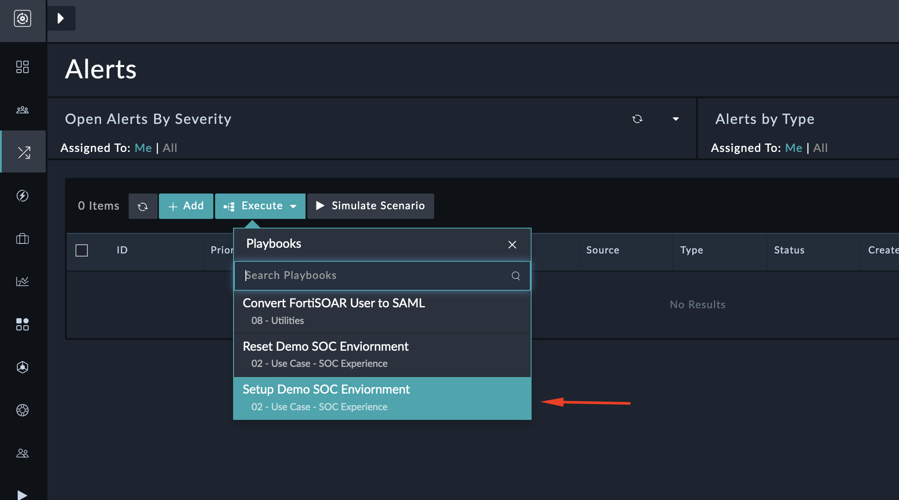
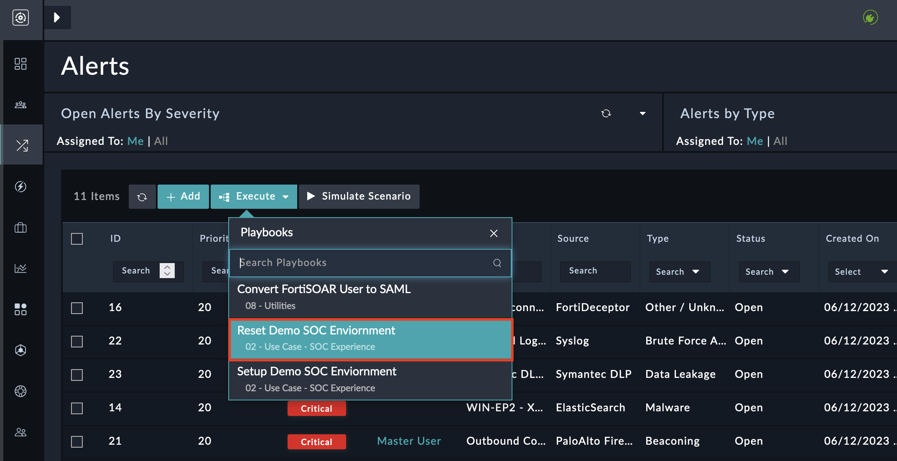

| [Home](../README.md) |
|----------------------|
# Usage

## Setup Demo SOC Environment
- In the Alert module, click on the execute button.
- Run the "Setup Demo SOC Environment" playbook.
- This playbook will execute all available scenarios in FortiSOAR and generate demo records.
- It will also perform data ingestion for MITRE ATT&CK, creating the latest records for all MITRE-related modules.

    

## Reset Demo SOC Environment
- In the Alert module, click on the execute button
- Run the "Reset Demo SOC Environment" playbook.

    